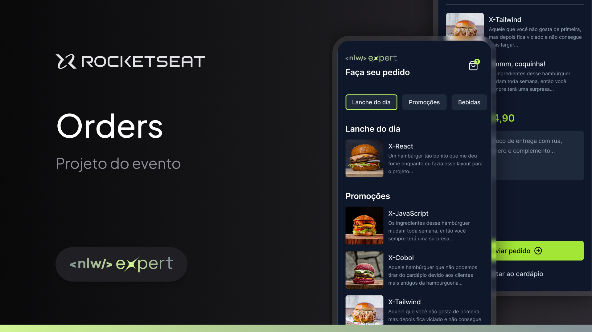
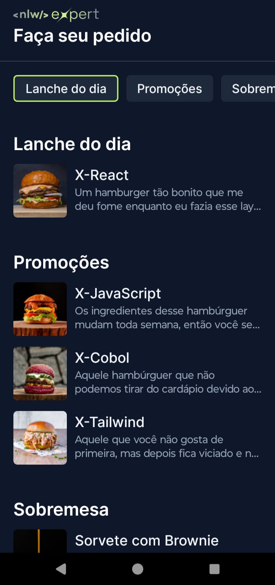
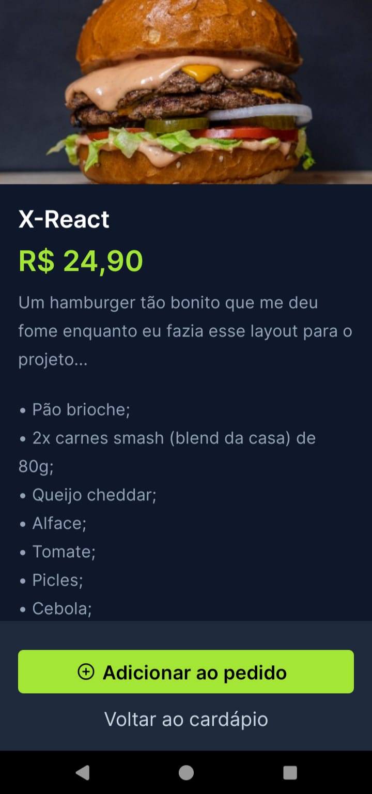
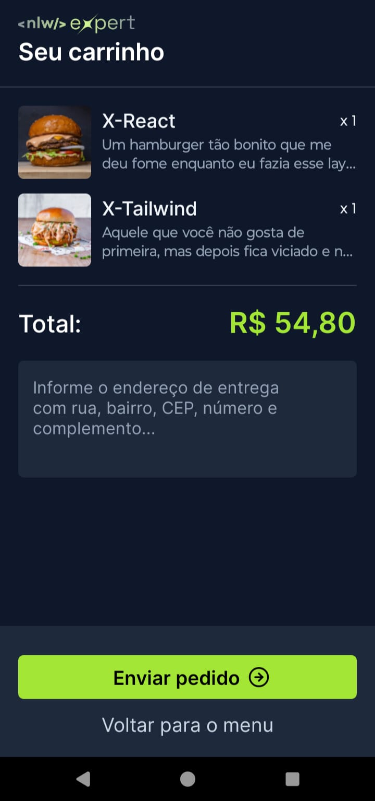

<!-- CABEÇALHO -->

    <h1>
        Orders (Menu App)
    </h1>
    

        <a href="#%EF%B8%8F-sobre-o-projeto">Sobre o Projeto</a> •
        <a href="#-funcionalidades">Funcionalidades</a> •
        <a href="#-layout">Layout</a> •
        <a href="#%EF%B8%8F-tecnologias">Tecnologias</a> •
        <a href="#-autor">Autor</a>
    

<!-- SOBRE O PROJETO -->

## 🖥️ Sobre o Projeto

        

 

> Projeto desenvolvido na 14ª edição do **Next Level Week** da Rocketseat, ocorrido entre 5 e 8 de fevereiro de 2024.

Esse projeto consiste em uma aplicação de menu digital para fazer pedidos em um restaurante.

<!-- FUNCIONALIDADES -->

## 💡 Funcionalidades

- [x] Listar produtos
- [x] Exibir detalhes de um produto
- [x] Adicionar produto no carrinho de compras
- [x] Enviar o pedido pelo WhatsApp

<!-- LAYOUT -->

## 🎨 Layout

> A aplicação tem como base o seguinte layout no [Figma](https://www.figma.com/community/file/1336456468568916765/nlw-expert-orders)

  
  
  

<!-- TECNOLOGIAS -->

## 🛠️ Tecnologias

Para o desenvolvimento desse projeto, as seguintes ferramentas foram utilizadas:

- **[React Native](https://reactnative.dev/)**
- **[TypeScript](https://www.typescriptlang.org/)**
- **[Expo](https://expo.dev/)**
- **[NativeWind](https://www.nativewind.dev//)**
- **[Zustand](https://zustand-demo.pmnd.rs/)**

## 👨‍💻 Autor

Marcos Kenji Kuribayashi

 

---

Desenvolvido por Marcos Kenji Kuribayashi 😉
